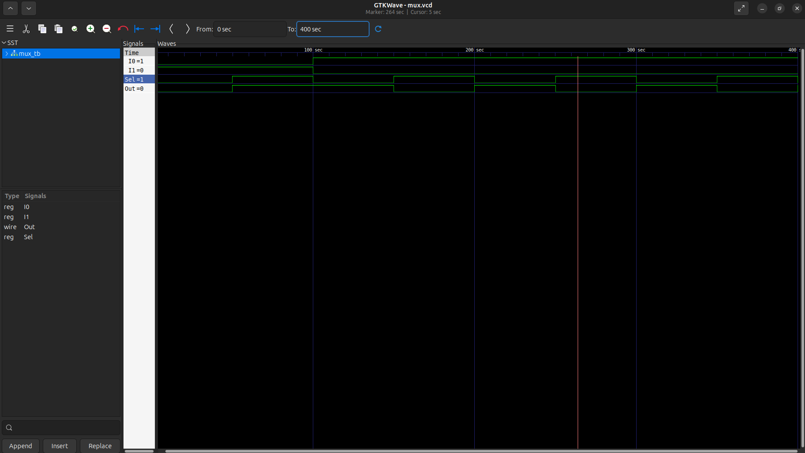
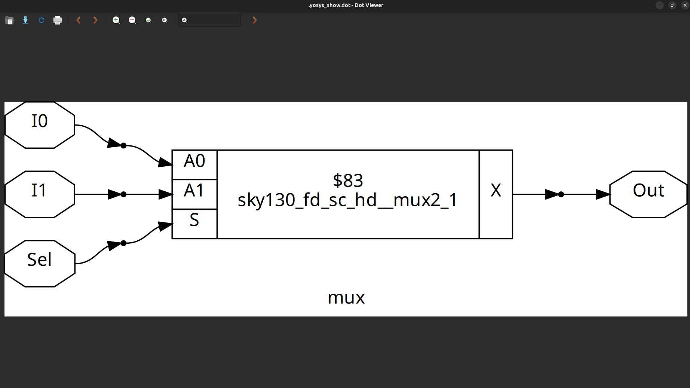

# Day 1: Introduction to Verilog RTL Design & Synthesis

Welcome to **Day 1** of the RTL Workshop!  
Today, we will explore the basics of digital design using **Verilog**, simulate designs with **Icarus Verilog (iverilog)** and **GTKWave**, and perform synthesis with **Yosys** using the **Sky130 PDK**.

---

## Table of Contents

1. [What is RTL Design?](#1-what-is-rtl-design)
2. [What is a Testbench?](#2-what-is-a-testbench)
3. [What is RTL Synthesis?](#3-what-is-rtl-synthesis)
4. [Introduction to iverilog & GTKWave](#4-introduction-to-iverilog--gtkwave)
5. [Introduction to Yosys & Sky130 PDKs](#5-introduction-to-yosys--sky130-pdks)
6. [Design Code, Waveform & Netlist](#6-design-code-waveform--netlist)
7. [Summary](#7-summary)

---

## 1. What is RTL Design?

**RTL (Register Transfer Level) design** is a method of describing the behavior of digital circuits in terms of **registers and the data transferred between them**.  
- Focuses on **clocked operations**.  
- Describes **how data moves** through combinational logic and storage elements.  
- Written using **hardware description languages (HDLs)** like Verilog or VHDL.  

---

## 2. What is a Testbench?

A **testbench** is a **simulation environment** used to verify your design:  
- It applies **stimuli (inputs)** to your RTL design.  
- Checks if the **outputs** behave as expected.  
- Contains **no physical hardware**, only simulation code.  

**Example diagram:**


---

## 3. What is RTL Synthesis?

**RTL synthesis** is the process of converting **RTL code into a gate-level netlist** that can be implemented in hardware:  
- Maps **Verilog code** to actual logic gates from a **standard cell library**.  
- Optimizes for **area, speed, and power**.  
- Performed using tools like **Yosys**. 
---

## 4. Introduction to iverilog & GTKWave

**iverilog** is an open-source Verilog simulator.  
**GTKWave** is a waveform viewer used to visualize simulation outputs.

### 4.1 Installing iverilog
```bash
sudo apt update
sudo apt install iverilog
```


## Simulation Flow:
- Write RTL design and testbench.
- Compile with iverilog.
- Run simulation to generate .vcd waveform file.
- Open .vcd in GTKWave to inspect signals.


## 5. Introduction to Yosys & Sky130 PDKs

Yosys is an open-source tool for:

-Synthesis: Converts HDL code to gate-level netlists.
-Optimization: Improves timing, area, or power.
-Technology mapping: Maps logic to specific standard cells.

Sky130 PDK (Process Design Kit) is a library for designing chips in the SkyWater 130nm process:

-Contains standard cells (.lib files) with timing, power, and area data.
-Used by Yosys to map Verilog designs to physical gates.

```
yosys 

read_liberty -lib /home/veeraragavan/SoC_TapeOut_Program/Week0/sky130_fd_sc_hd__tt_025C_1v80.lib
read_verilog /home/veeraragavan/SoC_TapeOut_Program/Week0/verilog_files/good_mux.v
synth -top good_mux
abc -liberty /home/veeraragavan/SoC_TapeOut_Program/Week0/sky130_fd_sc_hd__tt_025C_1v80.lib
show
```
## 6. Design Code, Waveform & Netlist

### 6.1 2-to-1 Multiplexer Verilog Code

```
Verilog

module mux(input I0,I1,Sel,output Out);
assign Out = Sel ? I1 : I0;
endmodule
```

### 6.2 Testbench (mux_tb.v)
```
Verilog

module mux_tb();
reg I0=0,I1=1,Sel=0;
wire Out;

mux dut (.I0(I0),
	 .I1(I1),
	 .Sel(Sel),
	 .Out(Out));

always #50 Sel = ~Sel;

initial begin
#100 I0 = 1; 
     I1 = 0;
#300 $finish;

end

initial begin
$dumpfile("mux.vcd");
$dumpvars(0);
end

endmodule
```
### 6.3 Simulation Waveform


### 6.4 Gate-level Netlist


## 7. Summary

1.RTL design describes circuits at the register-transfer level.
2.Testbenches are used for verification in simulation.
3.RTL synthesis converts Verilog code to gates using libraries.
4.iverilog and GTKWave help simulate and visualize designs.
5.Yosys with Sky130 PDK maps RTL to real hardware gates.
6.Lab: Implemented and verified a 2-to-1 multiplexer.
