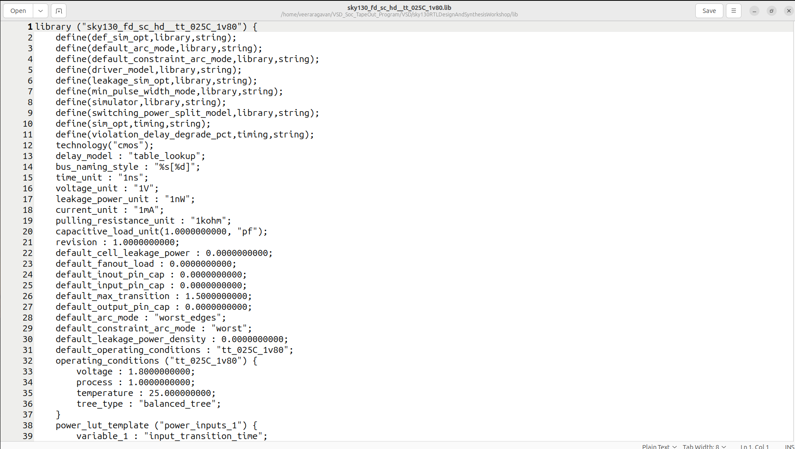

# DAY-2  Timing libs,hierarchical vs flat synthsis and efficient flop coding styles

## VLSI Library Overview

## 1. What is a library in VLSI?

A library is a collection of pre-designed, pre-characterized cells (like gates, flip-flops, multiplexers, etc.) that you can use to build larger circuits.
Think of it as a toolbox for digital designers.Each cell in the library comes with functional description, timing info, and electrical characteristics.

---

## 2. Types of library files

In VLSI, library files are usually of different types, serving different purposes in the design flow:

### a) Behavioral / RTL libraries
- Used during synthesis.
- Describe function of cells (like AND, OR, D Flip-Flop).
- Example: **liberty (.lib) file** — describes timing, power, and area.

### b) Layout / LEF files
- Used in place-and-route tools.
- **LEF = Library Exchange Format.**
- Contains physical dimensions, pin locations, metal layers.

### c) Gate-level / SPICE libraries
- Used in simulation and characterization.
- SPICE netlists describe transistor-level implementation for accuracy.

### d) Timing & power libraries
- **.lib (Synopsys Liberty format)** is the most common.
- Contains:
  - Timing models → delay, setup, hold.
  - Power models → dynamic, leakage.
  - Noise characteristics → signal integrity info.

---

## 3. Why library files are important

- **Saves time** → You don’t design every gate from scratch.
- **Accuracy** → Pre-characterized delays and power give realistic results.
- **Portability** → Tools like Synopsys, Cadence, or Mentor can use standard libraries.
- **Consistency** → All designers use the same definitions of cells.

---

## 4. Example flow using library files

1. **RTL Design** → You write Verilog/VHDL.
2. **Synthesis tool** → Uses .lib file to map RTL to gates.
3. **Place-and-route** → Uses LEF/DEF + cell library for physical design.
4. **Post-layout simulation** → Uses SPICE netlist of library cells for accurate timing.



## 1. Library Declaration

```
library ("sky130_fd_sc_hd__tt_025C_1v80") {
```
- This names the library: sky130_fd_sc_hd__tt_025C_1v80.
- Likely for the SkyWater 130nm process.
- fd_sc_hd → full design, standard cells, high density.
- tt_025C_1v80 → typical process, 25°C, 1.8V supply.


## 2. Defines and Options

```
define(def_sim_opt, library, string);
define(driver_model, library, string);
...
```
- These are generic definitions for the library behavior, simulation, and power models.
- They provide default options for timing, leakage, switching, etc.

## 4. Default Parameters
```
default_cell_leakage_power : 0.0000000000;
default_max_transition : 1.5000000000;
```
- These are fallback values for cell characteristics if specific data is missing.
- Includes capacitances, max rise/fall time, leakage power, etc.

## 5. Operating Conditions

```
operating_conditions ("tt_025C_1v80") {
    voltage : 1.8;
    process : 1.0;
    temperature : 25.0;
    tree_type : "balanced_tree";
}
```

## Specifies the conditions under which timing and power are characterized:
- Voltage: 1.8V
- Temperature: 25°C
- Process corner: typical-typical (tt)

## 6. Power/Timing Templates

```
power_lut_template ("power_inputs_1") {
    variable_1 : "input_transition_time";
    variable_2 : "total_output_net_capacitance";
}
```
- Defines how power is calculated based on input transition time and load capacitance.
- These tables are later used by synthesis and static timing analysis tools.


