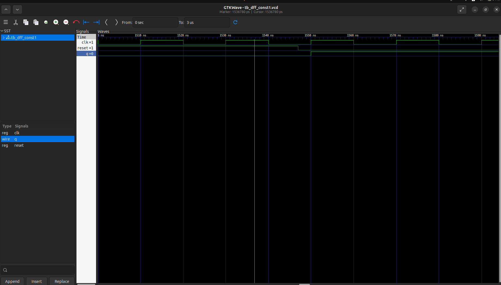
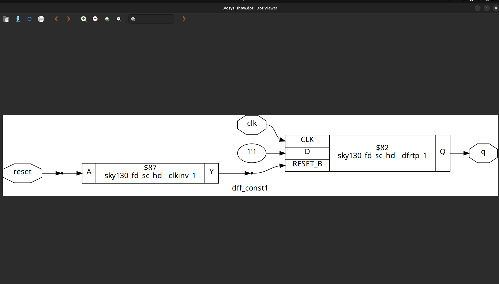
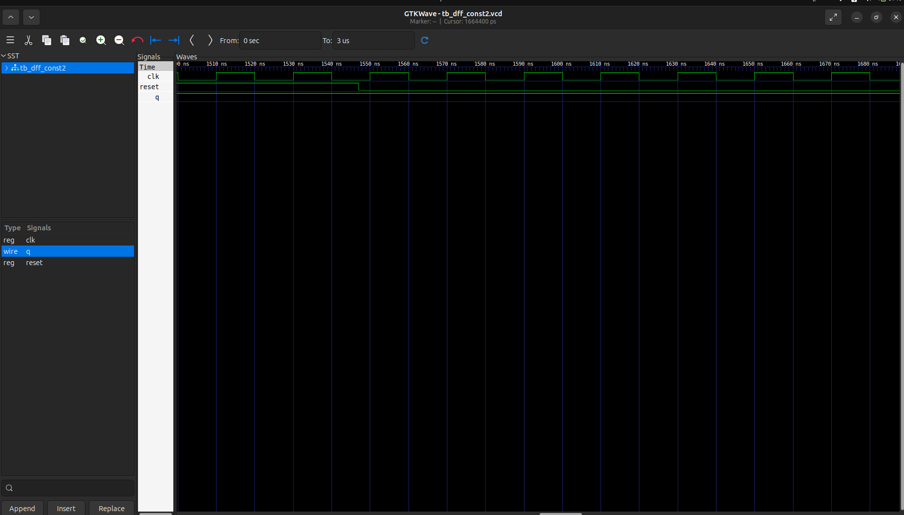
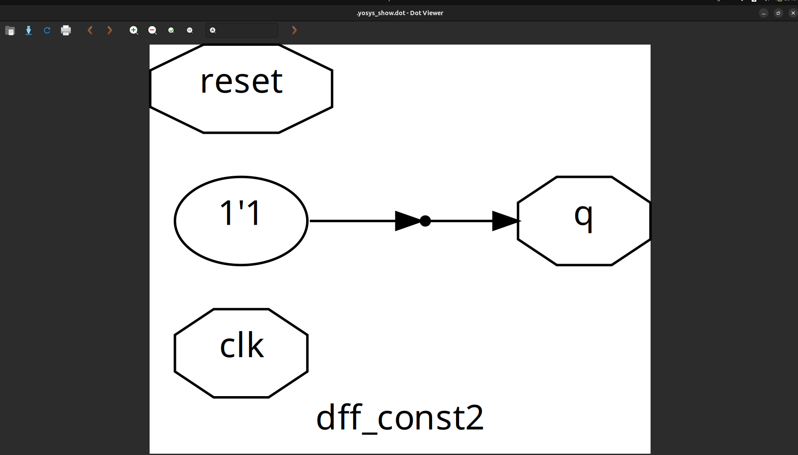
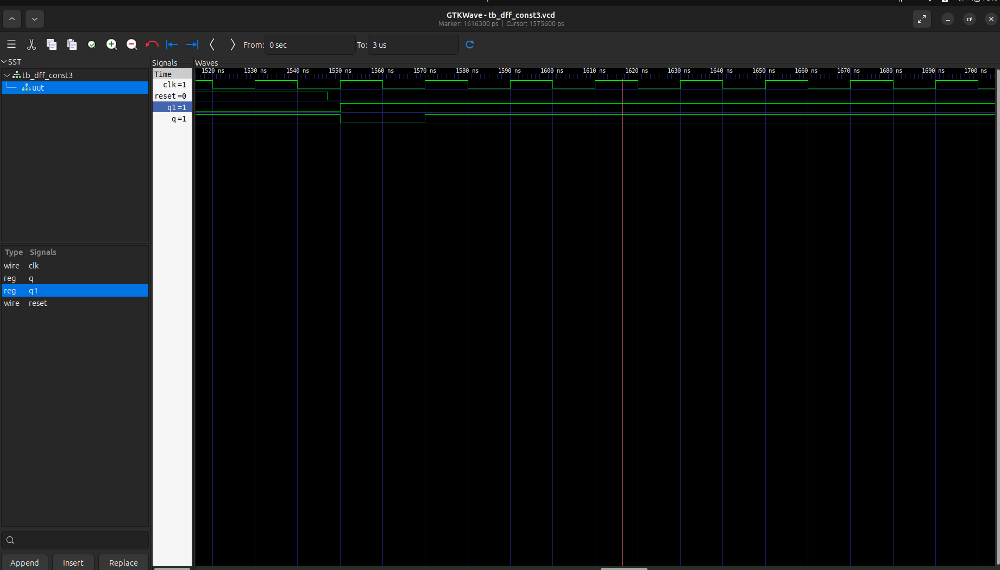
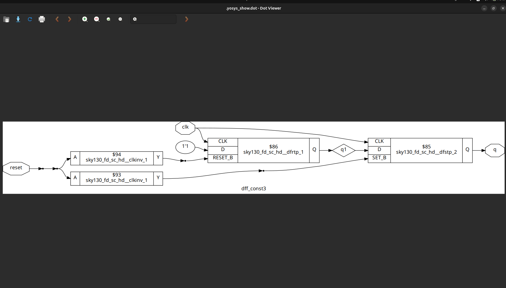

# DAY-3  Combinational and Sequential Optimization

This repository covers key optimization methods used in digital circuit design and synthesis, along with practical lab experiments to understand their implementation.

---

## Topics Covered

### 1. Constant Propagation

Constant propagation is a logic optimization technique where constant values are propagated through the circuit.

* **Concept**: If the value of a signal is known at compile-time (e.g., `a = 1` or `b = 0`), the logic expression can be simplified by substituting constants.
* **Example**:

  ```
  y = a & 1  →  y = a
  y = b | 0  →  y = b
  y = a & 0  →  y = 0
  ```
* **Advantages**:

  * Reduces gate count.
  * Minimizes power consumption.
  * Improves area and timing performance.

---

### 2. State Optimization

State optimization refers to reducing the number of states in a **Finite State Machine (FSM)** without changing its functionality.

* **Concept**: Equivalent or redundant states are merged to form a minimized FSM.
* **Methods**:

  * **Row Equivalence**: Combine states with identical next-state and output behavior.
  * **State Minimization Algorithms**: e.g., partitioning method or implication table.
* **Benefits**:

  * Smaller state transition table.
  * Reduced flip-flops for state encoding.
  * Lower complexity and area.

---

### 3. Cloning

Cloning is the process of duplicating a logic block to improve **timing or load balancing**.

* **Concept**: When a signal drives too many loads (high fan-out), delay increases. Duplicating the logic reduces fan-out per driver.
* **Example**:
  Instead of one adder driving 10 loads, two adders (clones) can each drive 5 loads.
* **Advantages**:

  * Reduces critical path delay.
  * Balances signal distribution.
  * Improves performance in large circuits.
* **Trade-off**:

  * Slightly increases area due to additional logic.

---

### 4. Retiming

Retiming is a **sequential optimization technique** where registers are repositioned across combinational logic to balance delays.

* **Concept**: The functionality remains unchanged, but the placement of registers is altered.
* **Purpose**:

  * To reduce the longest combinational delay (critical path).
  * To achieve higher clock frequency.
* **Example**:
  A long logic path between two registers can be split by moving a register inside the path.
* **Benefits**:

  * Improves maximum clock speed.
  * Helps meet timing closure in synthesis.
* **Challenges**:

  * Must ensure functional equivalence.
  * Tool-based retiming may be restricted by reset/enable conditions.

---

## Labs on Optimization

The following labs demonstrate the above optimization techniques with hands-on experiments:

### Lab1 :

### code1 :
```
module opt_check (input a , input b , output y);
	assign y = a?b:0; //optimized to And gate with a,b input
endmodule
```

### Opt_Net1 :


### Lab2 :

### code2 : 
``` 
module opt_check2 (input a , input b , output y);
	assign y = a?1:b; // optimized to OR gate with input a,b(which is done by consenus theorem
endmodule

```

### Opt_Net2 :


### Lab3 :

### code3 : 
``` 
module opt_check3 (input a , input b, input c , output y);
	assign y = a?(c?b:0):0;//optimized to 3 input AND gate with input a,b,c
endmodule

```

### Opt_Net3 :


### Lab4 :

### code4 : 
``` 
module opt_check3 (input a , input b, input c , output y);
        assign y = a?(c?b:0):0;//optimized to 3 input AND gate with input a,b,c
endmodule

```

### Opt_Net4 :


### Lab5 :

### code5 : 
``` 
module dff_const1(input clk, input reset, output reg q);
always @(posedge clk, posedge reset)
begin
	if(reset)
		q <= 1'b0;
	else
		q <= 1'b1;
end

endmodule

```

### Waveform:



### Opt_Net5 :



### Lab6 :

### code6 : 
``` 
module dff_const2(input clk, input reset, output reg q);
always @(posedge clk, posedge reset)
begin
	if(reset)
		q <= 1'b1;
	else
		q <= 1'b1;
end

endmodule

```

### Waveform:



### Opt_Net6 :



### Lab7 :

### code7 : 
``` 
module dff_const3(input clk, input reset, output reg q);
reg q1;

always @(posedge clk, posedge reset)
begin
	if(reset)
	begin
		q <= 1'b1;
		q1 <= 1'b0;
	end
	else
	begin
		q1 <= 1'b1;
		q <= q1;
	end
end

endmodule

```

### Waveform:



### Opt_Net7 :



## Summary
Focus: Optimization techniques for combinational and sequential circuits in digital design, with practical Verilog labs.

### Topics Covered:

- Constant Propagation: Replacing variables with constant values to simplify logic and improve circuit efficiency.
- State Optimization: Reducing states and optimizing encoding in finite state machines to use less logic and power.
- Cloning: Duplicating logic cells/modules to improve timing and balance load.
- Retiming: Repositioning registers in a circuit to enhance performance without altering its function.
- Labs: Seven practical Verilog labs illustrate these concepts, including examples of combinational logic optimizations and D flip-flop behaviors, each with code snippets and output images.
