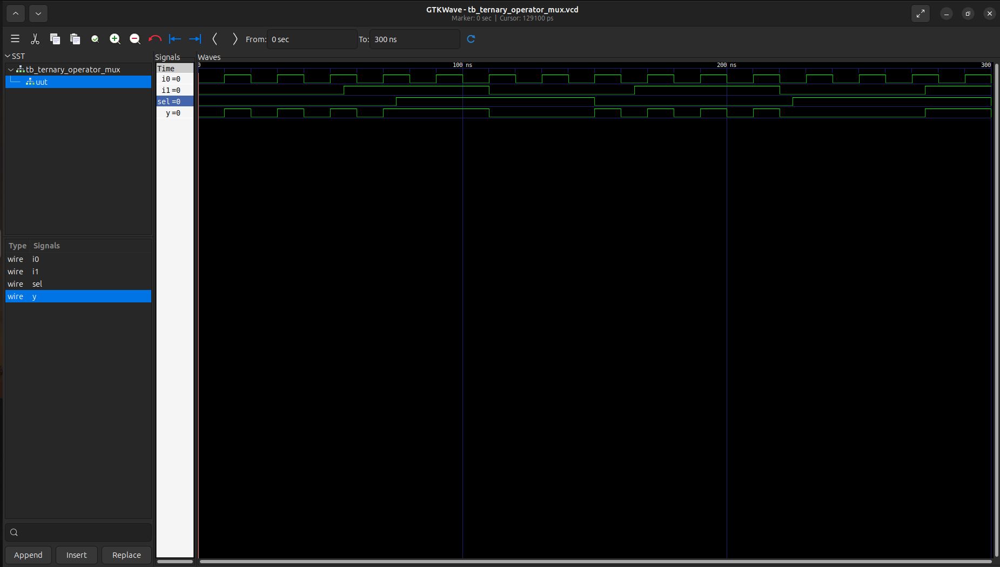
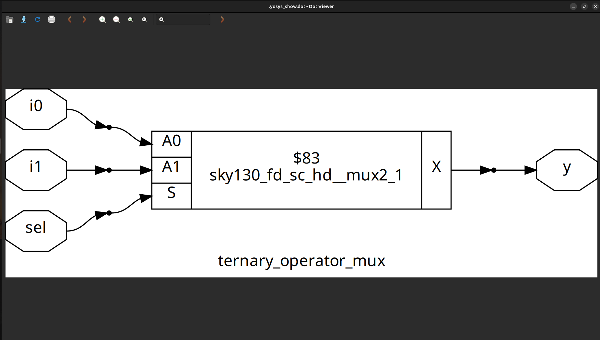
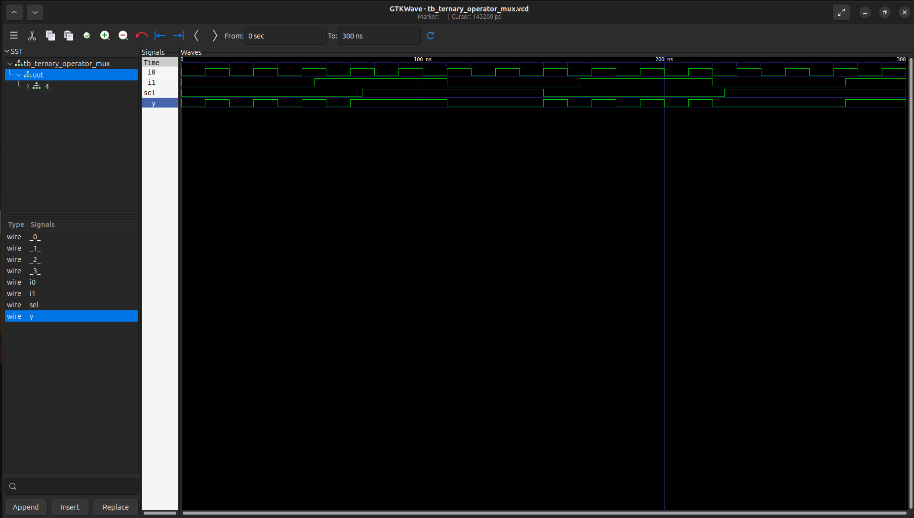
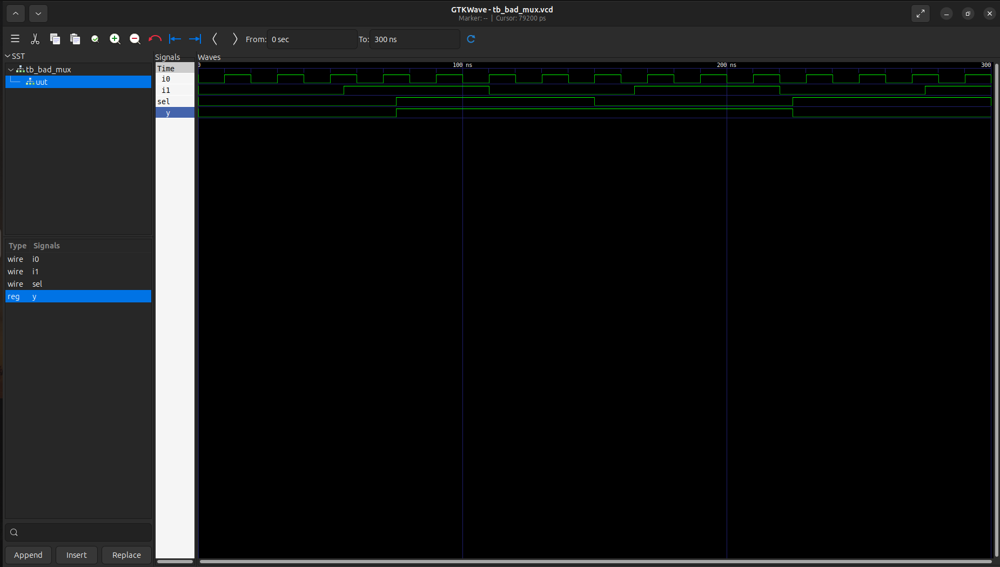
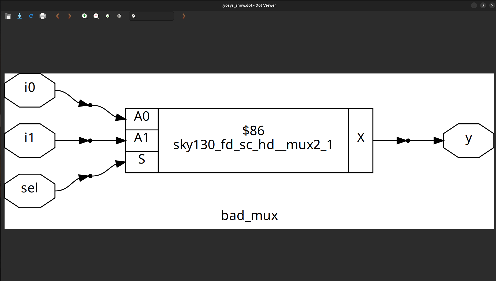
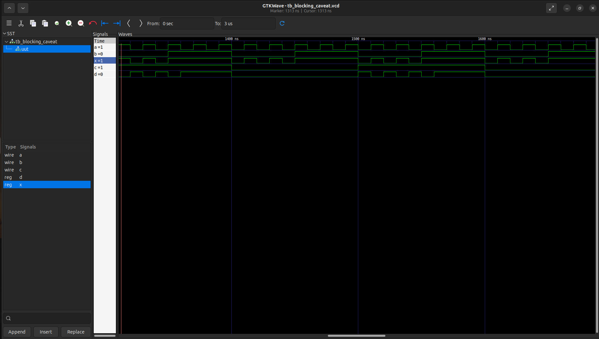
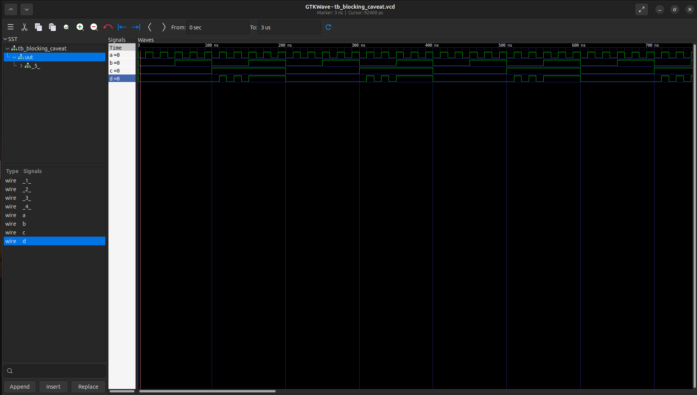

# Day 4: Gate-Level Simulation (GLS), Blocking vs. Non-Blocking in Verilog, and Synthesis-Simulation Mismatch

Welcome to **Day 4 of the RTL Workshop!**
Today’s session focuses on three essential topics in digital design:

* **Gate-Level Simulation (GLS)**
* **Blocking vs. Non-Blocking Assignments in Verilog**
* **Synthesis-Simulation Mismatch**

You’ll learn both the theory and practical implications, complete with hands-on labs to reinforce your understanding.

---

## Table of Contents

1. [Gate-Level Simulation (GLS)](#1-gate-level-simulation-gls)
2. [Synthesis-Simulation Mismatch](#2-synthesis-simulation-mismatch)
3. [Blocking vs. Non-Blocking Assignments in Verilog](#3-blocking-vs-non-blocking-assignments-in-verilog)

   * [Blocking Statements](#31-blocking-statements)
   * [Non-Blocking Statements](#32-non-blocking-statements)
4. [Labs](#4-labs)
5. [Summary](#5-summary)

---

## 1. Gate-Level Simulation (GLS)

**Gate-Level Simulation (GLS)** is the simulation of a netlist generated after **synthesis**.

* **Purpose**:

  * To verify that the synthesized netlist behaves the same as the RTL code.
  * To check for timing issues and initialization mismatches.
* **Key Points**:

  * RTL simulation assumes ideal conditions (zero delays).
  * GLS includes gate delays and realistic behavior of standard cells.
  * It helps detect synthesis-related bugs, such as missing resets or X-propagation.
* **Challenges**:

  * Slower compared to RTL simulation.
  * Debugging is harder due to low-level netlist representation.

---

## 2. Synthesis-Simulation Mismatch

**Synthesis-Simulation Mismatch** occurs when the behavior of RTL simulation differs from the synthesized hardware/netlist.

* **Common Causes**:

  * Improper sensitivity lists (e.g., using `always @(a)` instead of `always @(*)`).
  * Use of **blocking assignments** in sequential logic.
  * Using **delays (`#`)** in synthesizable code.
  * Inferring latches unintentionally.
* **Impact**:

  * Design may pass simulation but fail in actual hardware or post-synthesis verification.
* **Prevention**:

  * Follow coding guidelines for synthesizable Verilog.
  * Always use complete sensitivity lists or `@(*)` for combinational blocks.
  * Use non-blocking assignments (`<=`) for sequential logic.

---

## 3. Blocking vs. Non-Blocking Assignments in Verilog

In Verilog, assignments inside procedural blocks (`always`/`initial`) can be **blocking (`=`)** or **non-blocking (`<=`)**.

### 3.1 Blocking Statements

* **Syntax**: `=`
* **Execution**: Executes sequentially, one after another (like software).
* **Usage**:

  * Best suited for **combinational logic** and **testbenches**.
* **Example**:

  ```verilog
  always @(*) begin
      x = a & b;  // executes first
      y = x | c;  // uses updated value of x
  end
  ```

### 3.2 Non-Blocking Statements

* **Syntax**: `<=`
* **Execution**: All RHS expressions are evaluated first, and assignments happen **in parallel** at the end of the time step.
* **Usage**:

  * Best suited for **sequential logic** (flip-flops).
* **Example**:

  ```verilog
  always @(posedge clk) begin
      q1 <= d;    // all updates scheduled
      q2 <= q1;   // q2 gets old value of q1, not updated one
  end
  ```

**Rule of Thumb**:

* Use **blocking (`=`)** for combinational logic.
* Use **non-blocking (`<=`)** for sequential logic.

---

## 4. Labs

### Lab1:

### Ternary_Operated_Mux

```
module ternary_operator_mux (input i0 , input i1 , input sel , output y);
	assign y = sel?i1:i0;
	endmodule

```

### Gtkwave simulation waveform




### Netlist through yosys



### Gate Level Simulation

- It produces the simulation as same as the RTL simulation so there is no simulation missmatch


### Lab2:

### Bad_Mux

```
module bad_mux (input i0 , input i1 , input sel , output reg y);
always @ (sel)
begin
	if(sel)
		y <= i1;
	else 
		y <= i0;
end
endmodule

```

### Gtkwave simulation waveform




### Netlist through yosys



### Gate Level Simulation

- It produces the simulation which is not same as the RTL simulation so there is a simulation missmatch in the circuit. It happend because of the sensitivity list not includes the all signal but just the Select line


### Lab 3: Blocking Assignment Caveat

### Verilog Code (Buggy Version):

```
module blocking_caveat (input a, input b, input c, output reg d);
  reg x;
  always @ (*) begin
    d = x & c;
    x = a | b;
  end
endmodule
```

#### What’s Wrong?
The order of assignments causes d to use the old value of x, not the newly computed one.

#### Best Practice:
Always assign intermediate variables before using them.

#### Corrected Version:
```
always @ (*) begin
  x = a | b;
  d = x & c;
end
```

### Gtkwave simulation waveform




### Netlist through yosys


### Synthesis of the Blocking Caveat Module
Synthesize the corrected version of the blocking_caveat module.
Observe that synthesis tools implement the correct logic regardless of the order of statements, but simulation results may differ.
Learning Point: RTL coding style matters for avoiding simulation-synthesis mismatches.




## 5. Summary

- Gate-Level Simulation (GLS): Validates netlist functionality, timing, and testability after synthesis.
- Synthesis-Simulation Mismatch: Avoid mismatches by using synthesizable, unambiguous RTL code.
- Blocking vs. Non-Blocking:
- Use blocking (=) for combinational logic.
- Use non-blocking (<=) for sequential logic.
- Labs: Reinforced key concepts, highlighted common pitfalls (e.g., blocking caveat), and demonstrated how synthesis tools may differ from simulation.

---

