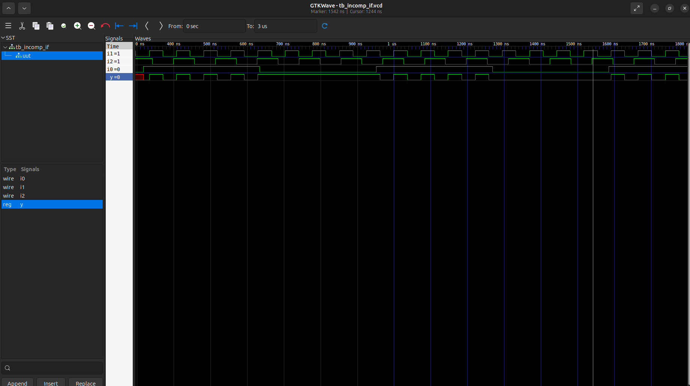
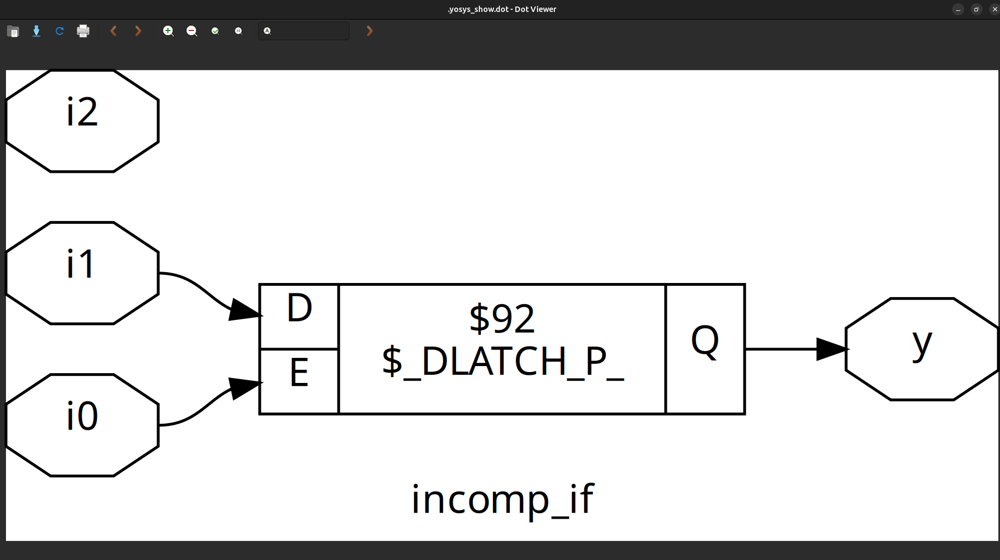
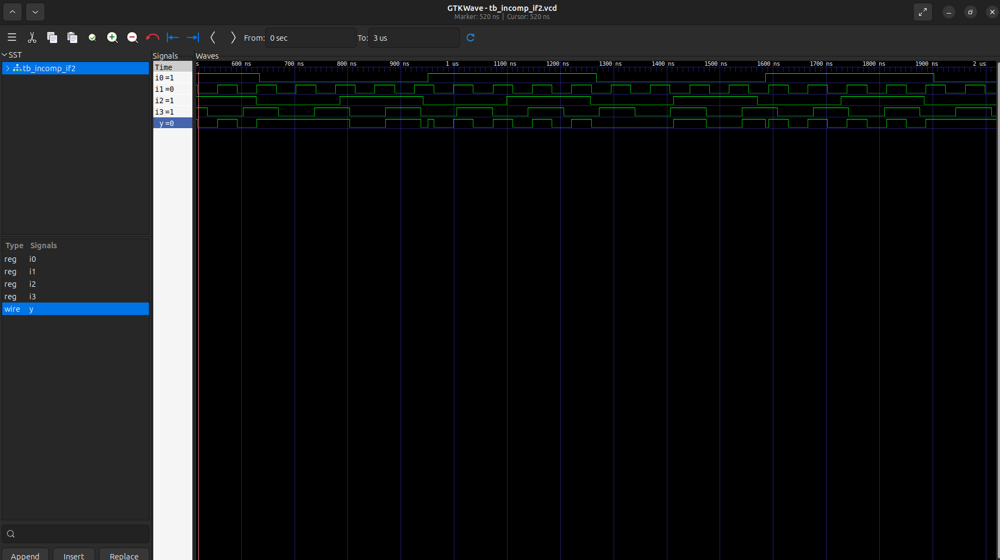
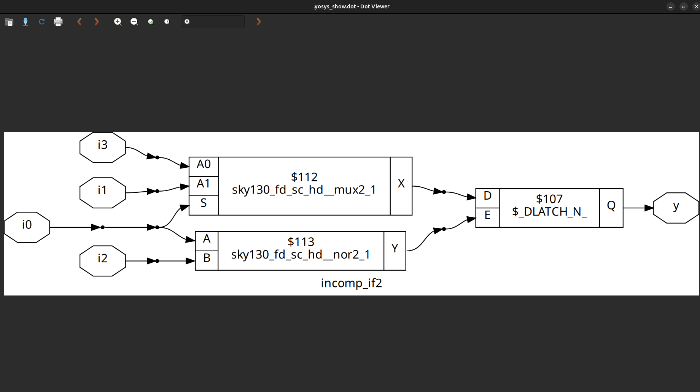

# Day 5: Optimization in Synthesis

Welcome to Day 5 of the RTL workshop! Today, we will cover optimization in Verilog synthesis, focusing on if-else statements, for loops, generate blocks, and explore how improper coding can lead to inferred latches. Labs are included for hands-on experience.


## 1. If-Else Statements in Verilog
If-else statements are used for conditional execution in behavioral modeling, typically within procedural blocks (always, initial, tasks, or functions).

```
Syntax
if (condition) begin
    // Code block executed if condition is true
end else begin
    // Code block executed if condition is false
end
```

- condition: An expression evaluating to true (non-zero) or false (zero).
- begin ... end: Used to group multiple statements. Omit if only one statement is present.
- The else part is optional.

```
Nested If-Else
if (condition1) begin
    // Code for condition1 true
end else if (condition2) begin
    // Code for condition2 true
end else begin
    // Code if no conditions are true
end
```

## 2. Inferred Latches in Verilog
Inferred latches occur when a combinational logic block does not assign a value to a variable in all possible execution paths. This causes the synthesis tool to infer a latch, which may not be the designer’s intention.

Example of Latch Inference

```
module ex (
    input wire a, b, sel,
    output reg y
);
    always @(a, b, sel) begin
        if (sel == 1'b1)
            y = a; // No 'else' - y is not assigned when sel == 0
    end
endmodule
```

- Problem: When sel is 0, y is not assigned, so a latch is inferred.
- Solution: Add Else or Default Case

```
module ex (
    input wire a, b, sel,
    output reg y
);
    always @(a, b, sel) begin
        case(sel)
            1'b1 : y = a;
            default : y = 1'b0; // Default assignment
        endcase
    end
endmodule
```

## 3. Labs for If-Else and Case Statements

### Lab 1: Incomplete If Statement


#### code:
```
module incomp_if (input i0, input i1, input i2, output reg y);
always @(*) begin
    if (i0)
        y <= i1;
end
endmodule

```
#### GTK Waveform:



#### IncompleteIf Netlist:




### Lab 2: Incomplete If Statement


#### code:
```
module incomp_if2 (input i0 , input i1 , input i2 , input i3, output reg y);
always @ (*)
begin
	if(i0)
		y <= i1;
	else if (i2)
		y <= i3;
end
endmodule
```
#### GTK Waveform:



#### IncompleteIf Netlist:


